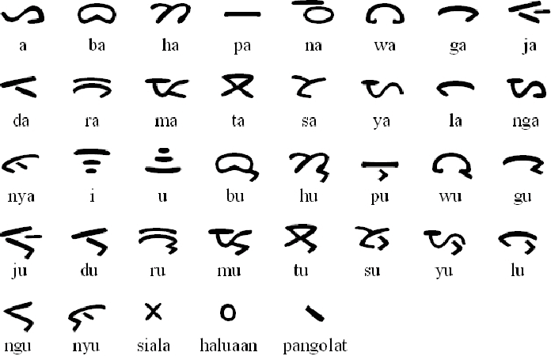

# Aksaratak Dataset

This is a dataset of close-up image of handwritten Batak characters. This dataset contains images of single Batak character. The reference of the letter is shown in the figure below.

## Metadata
- 19 letter class
- Total data: 1900 images (100 images for every class)
- Dimension: 100 x 100 pixels
- Format: png
- Collected: December 2023
